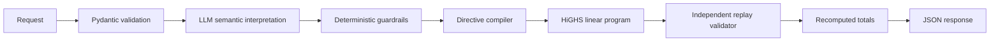

# GridWise - Smart Campus Energy Optimization API

GridWise is the BUP CSE Fest 2026 preliminary API. It interprets one to three
natural-language operator notes, validates the resulting directives, solves a
24-hour battery/solar/grid schedule with a deterministic linear program, and
independently replays the returned plan before responding.

## Architecture



The LLM interprets language only. It cannot edit demand, solar forecasts,
tariffs, battery parameters, or the final schedule. The optimizer owns all
energy decisions and the replay validator is the final correctness boundary.

## Supported directives

`solar_reduction`, `minimum_battery_reserve`, `no_charge_window`,
`no_discharge_window`, `max_grid_window`, and `no_op`.

Windows are whole-hour, start-inclusive, and end-exclusive. Solar factors are
the fraction remaining: an 80% reduction means `factor: 0.2`. A reserve
percentage is converted using the supplied battery capacity. Unrelated notes
become `no_op`.

## API

### Dashboard

Open `http://127.0.0.1:8000/` for the GridWise dashboard. It loads the public
sample pack, lets you edit operator notes and battery settings, submits the
scenario to `/optimize-energy`, and presents the validated plan as KPI cards,
directive summaries, an energy profile, and a 24-hour table. The Swagger API
remains available at `http://127.0.0.1:8000/docs`. The dashboard defaults to
the exact JSON request format expected by the API; a visual editor is available
as an optional convenience mode.

### `GET /health`

Returns `{"status":"ok"}` without calling the model.

### `POST /optimize-energy`

The request contains:

- `scenario_id`: non-empty string
- `operator_notes`: one to three non-empty strings
- `hours`: exactly one record for each hour `0..23`, containing
  `demand_kwh`, `solar_kwh`, and `tariff_bdt_per_kwh`
- `battery`: capacity, initial energy, minimum energy, and charge/discharge
  rate limits

The successful response echoes `scenario_id`, returns one validated
`directive_interpretation` per note, a 24-row `hourly_plan`, recomputed
`total_grid_kwh`, `total_cost_bdt`, `peak_grid_kwh`, and a deterministic
`plan_summary`.

## Local setup

Python 3.12 is required.

```powershell
python -m venv .venv
.\.venv\Scripts\Activate.ps1
python -m pip install -e ".[test]"
Copy-Item .env.example .env
# Edit .env and set LLM_API_KEY to a provider credential.
```

The provider must expose an OpenAI-compatible `/chat/completions` endpoint and
support structured JSON output. Configuration is read from the process
environment, and the project-local `.env` is loaded automatically. Both launch
styles are supported:

```powershell
python -m uvicorn app.main:app --host 0.0.0.0 --port 8000
# Equivalent explicit form:
python -m uvicorn app.main:app --env-file .env --host 0.0.0.0 --port 8000
```

The example defaults to the OpenAI-compatible Groq endpoint and
`openai/gpt-oss-20b`; another compatible provider can be selected with the
same variables.

```powershell
curl http://127.0.0.1:8000/health
python scripts/generate_local_test.py | curl -X POST http://127.0.0.1:8000/optimize-energy -H "Content-Type: application/json" --data-binary @-
```

The live optimization endpoint needs a model credential. Offline tests inject a
fake interpreter and do not need one.

## Environment variables

```env
LLM_API_KEY=
LLM_MODEL=openai/gpt-oss-20b
LLM_BASE_URL=https://api.groq.com/openai/v1
LLM_TIMEOUT_SECONDS=12
LLM_MAX_RETRIES=1
```

Never commit `.env`, paste credentials into documentation, or print them in
logs. `.env.example` contains placeholders only.

## Tests and public samples

Run the offline test suite:

```powershell
pytest -q
```

Validate every case in the organizer's public pack (the script does not embed
case IDs, note wording, schedules, or numeric values):

```powershell
python scripts/validate_public_samples.py `
  .\BUP_CSE_FEST_2026_Preli_Public_Sample_Cases.json
```

The validator checks HTTP success, response schema, directive semantics,
independent replay, recomputed totals, and cost against each public optimum.
Equivalent schedules are accepted. The supplied pack contains 10 public
cases; the submission target is 10/10 passes. The latest run result should be
recorded from the command output rather than assumed.

Current local verification: the deterministic optimizer and the validator pass
all 10 public cases when supplied with the published interpretations. A live
HTTP run requires a valid configured provider credential; the credential used
in the local environment returned controlled provider-unavailable responses.

## Docker

```powershell
docker build -t gridwise:local .
docker run --rm -p 8000:8000 --env-file .env gridwise:local
curl http://127.0.0.1:8000/health
```

The image binds to `0.0.0.0:8000`, runs as a non-root user, contains no `.env`,
and has a healthcheck. A private registry fallback can be used during the
event:

```powershell
docker tag gridwise:local ghcr.io/ORG/gridwise:latest
docker push ghcr.io/ORG/gridwise:latest
docker pull ghcr.io/ORG/gridwise:latest
docker run --rm -p 8000:8000 --env-file .env ghcr.io/ORG/gridwise:latest
```

## Dependencies and limitations

FastAPI and Pydantic provide the HTTP/schema contract, `httpx` calls the
configured model, SciPy/HiGHS solves the deterministic LP, and Uvicorn serves
the API. No database or frontend is required. A live provider credential is
required for natural-language interpretation in production; provider failures
return sanitized controlled errors. The organizer's public samples are
validation references, not hidden-case data, and must not be hard-coded.

Repository visibility, deployment credentials, provider environment variables,
registry publication, and any submission video remain manual deployment steps.
