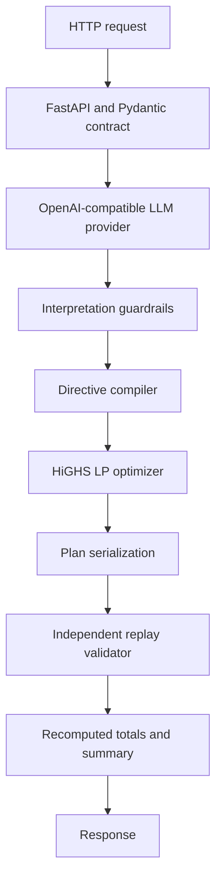

# Architecture

## Responsibilities

`app/models.py` owns strict request and response data shapes. `app/llm` sends
the notes as untrusted data to one OpenAI-compatible structured-output model
call and optionally makes one bounded repair call. It never receives or
returns optimization calculations.

`app/guardrails.py` treats the model result as untrusted. It checks exact note
coverage, supported directives, adjustment fields, hour semantics, numeric
bounds, and `no_op` rules. `app/directives.py` converts validated directives
into deterministic per-hour constraints.

`app/optimizer.py` models grid import, solar use, signed battery movement, and
after-hour state in a linear program. It minimizes tariff-weighted grid import
while enforcing energy balance, battery limits, directive constraints, and
end-of-day neutrality.

`app/validator.py` independently replays the final public plan. It does not
trust solver internals or model output and rejects any violation before a
successful response is returned. The same module recomputes totals from the
final rows.

## Failure boundaries

Malformed requests are handled as sanitized 400 responses. Missing or
unavailable providers are sanitized 503 responses. Infeasible optimization is
a sanitized 422 response. An unexpected internal or replay failure does not
leak stack traces, provider responses, or credentials.

## Deployment

The container installs the package from `pyproject.toml`, copies only runtime
code, binds Uvicorn to `0.0.0.0:8000`, and runs as a non-root user. Credentials
are supplied at runtime through environment variables and are excluded from
the build context.
